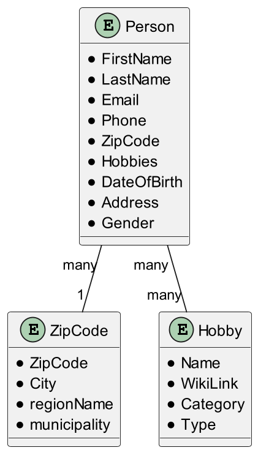
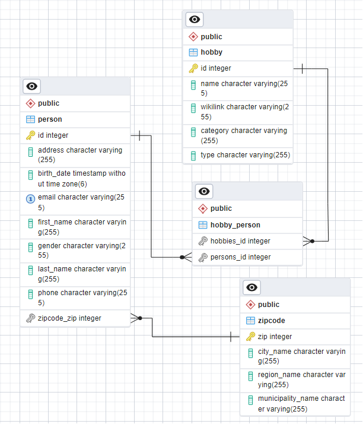

# SP1 JPA Project Hobby

Morten Bomholt Mikkelsen, cph-mm769@cphbusiness.dk , GitHub:  mbm1337

Mustafa Altinkaya, cph-ma763@cphbusiness.dk , GitHub: altinkaya

Sumaia El-Kalache, cph-se160@cphbusiness.dk , GitHub: sumaiak

Mounir Salem, cph-ms848@cphbusiness.dk , GitHub: ETHMUNI

The business idea is to create a platform that not only provides information about people and their hobbies but also offers a matchmaking service. Users can input their hobbies and interests, and the platform can connect them with like-minded individuals or groups in their local area. This would add a social networking element to the service and encourage people to explore new hobbies together, fostering real-world connections.

Group work:
- We have been using GitHub to share our code and work on the project together.
- We used issues to keep track of what needs to be done and who is working on what.
- First couple of days we worked together at school, but after that we have been working from home and using Discord to communicate.

Technical Requirements:
- JPA
- JPQL
- Java Streams API
- Java Generics
- Maven
- JDK 17^
- JUnit 5
- Docker
- PostgresSQL
- pgAdmin
- Lombok

